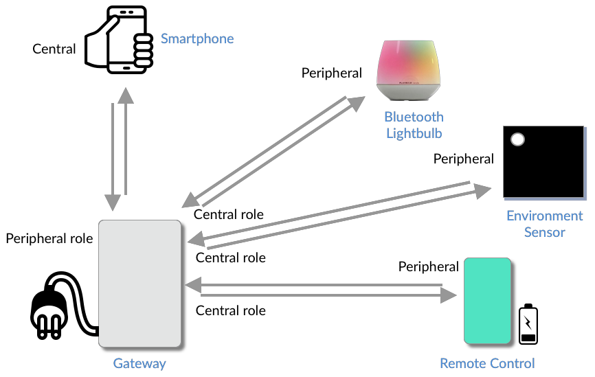
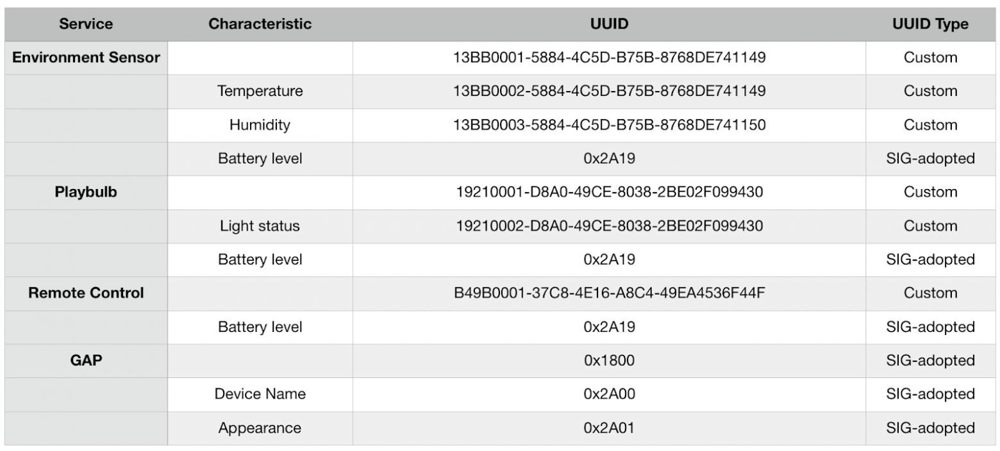
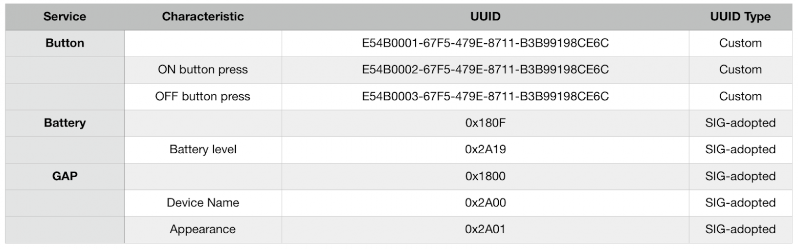

# 1. Создание собственного GATT

## 1.1. Общие рекомендации

**Убедиться, что внедрены обязательные сервисы и их характеристики:**

- Сервис общего профиля доступа (GAP)
- Заданы характеристики имени и окружения

**Использовать одобренные Bluetooth `SIG` профили, сервисы и характеристики там, где это возможно. Это дает следующие преимущества:**

1. Уменьшается размер передаваемых пакетов, содержащих UUID сервисов и характеристик (включая пакеты адвертайзинга).  
ускоряется процедуру обнаружения и другие процедуры за счет использования 16-битных UUID вместо 128-битных
2. Производители модулей и чипсетов обычно предоставляют примеры реализации этих сервисов в своих примерах и SDK - уменьшая нужное вам время на разработку.
3. Большее число сторонних устройств и приложений сможет взаимодействовать с вашим, тем самым расширяя число возможных пользовательских сценариев

**Группировать характеристики, отвечающие за смежный функционал, в один сервис.**  

**Избегать создания сервисов, имеющий слишком большое количество характеристик.**  

## 1.2. Процесс создания GATT для системы домашней автоматизации

> Система состоит из множества устройств. Некоторые из них куплены в магазине, и мы не можем как-то изменить их прошивку, остальные подлежат модификации в соответствии с нашими нуждами.

### 1.2.1. Общее описание системы

Основные пользовательские сценарии для системы:  

1. Владелец дома может использовать пульт дистанционного управления для включения и выключения светильника.
2. Владелец дома может наблюдать за изменениями показаний температуры и влажности на сенсоре окружающей среды.
3. Владелец дома получает уведомления об уровне заряда батареи всех элементов системы

### 1.2.2. Элементы системы

#### 1.2.2.1. Шлюз

> Шлюз будет выполнять роль `центрального BLE устройства` во время обмена данными со всеми устройствами кроме смартфона, где он будет выполнять роль периферийного устройства. Мы можем контролировать это устройство и спроектируем GATT для него.
Команды для управления светильником будут поступать с пульта управления на шлюз, и с него на сам светильник.

#### 1.2.2.2. Пульт управления

Пульт управления это устройство, которое выполняет только `периферийную роль`, для него мы также спроектируем GATT.

#### 1.2.2.3. Сенсор окружающей среды

Это стандартное устройство, GATT которого мы не можем изменить, так что область нашего интереса будет ограничена чтением показаний с него (данные о текущей температуре и влажности).

#### 1.2.2.4. Светильник

Это еще одно стандартное устройство, которое мы не можем каким-либо образом изменить.

#### 1.2.2.5. Смартфон

Очередное стандартное устройство, мы будем использовать его для контроля системы.

### 1.2.3. Разработка GATT

#### 1.2.3.1. Документирования различных пользовательских сценариев

Несмотря на то, что `GATT` обычно больше сфокусирован на `периферийной` роли (так как обычно в роли `сервера`, предоставляющего данные, выступает `периферийное` устройство),  
`центральное устройство` также может выполнять роль `сервера` в особых случаях.  
Также, так как мы разрабатываем устройство, выполняющее обе роли (центральную и периферийную), это поможет нам понять,  
что должно произойти с каждой стороны, так как это повлияет на некоторые аспекты разработки системы и `GATT`.

##### 1.2.3.1.1. Пользовательский сценарий Шлюз

Шлюз выполняет роль как `центрального`, так и `периферийного` устройства.  
Каждая из этих ролей используется для обеспечения связи с различными устройствами, входящими в состав системы.  
Основная задача шлюза как `центрального устройства` - считывать показания с множества периферийных устройств.  
Затем он, действуя в роли `периферийного устройства`, предоставляет собранные и обработанные данные другому центральному устройству (смартфону), который может передать эти данные на облачный сервер.  

Рассмотрим пользовательские сценарии с точки зрения шлюза, для центральной и периферийной роли:

###### 1.2.3.1.1.1. Периферийная роль

1. Пульт управления `уведомляет` шлюз, когда кнопки на нем нажимаются, для включения и выключения светильника.
2. Данные должны передаваться на облачный сервер через шлюз. Они представлены центральному устройству (например смартфону, имеющему доступ в интернет) в виде `GATT-сервера` в периферийной роли:

- Показания температуры датчика окружающей среды
- Показания влажности датчика окружающей среды
- Статус светильника (включен или выключен)
- Уровни заряда батареи пульта, светильника и датчика окружающей среды.

###### 1.2.3.1.1.2. Центральная роль

Шлюз должен считывать некоторые данные, представленные устройствами, составляющими систему, и получать уведомления о других данных с этих устройств.

##### 1.2.3.1.2. Пульт управления

Пульт управления выполняет одну функцию: управляет светильником. Он выполняет исключительно периферийную роль и должен предоставлять следующую информацию:

- При нажатии кнопки `ВКЛ`: уведомить шлюз о том, что была нажата эта кнопка
- При нажатии кнопки `ВЫКЛ`: уведомить шлюз о том, что была нажата эта кнопка
- Уровень заряда батареи: шлюз должен иметь возможность читать данные о заряде батареи пульта и получать уведомления о его изменении.

#### 1.2.3.2. Настройка сервисов, характеристик и прав доступа

На этом шаге мы сгруппируем характеристики в группы (сервисы), объединяющие характеристики со схожим функционалом и зададим разрешения для каждой из них.

##### 1.2.3.2.1. Пользовательский сценарий Шлюз

У нас есть один GATT-сервер для шлюза в периферийной роли.  
Посмотрев еще раз на данные, которые нам нужно передавать, мы можем назначить им характеристики и сгруппировать их в следующие сервисы:

- Сервис датчика окружающей среды:
  
1. Характеристика показаний температуры датчика окружающей среды: “Температура”
Права: Чтение, уведомление.
2. Характеристика показаний влажности датчика окружающей среды: “Влажность”
Права: Чтение, уведомление.
3. Характеристика остаточного заряда аккумулятора: “Уровень заряда”
Права: Чтение, уведомление.

- Сервис светильника:
  
1. Текущее состояние светильника “Статус”
Права: Чтение, уведомление.
2. Характеристика остаточного заряда аккумулятора: “Уровень заряда”
Права: Чтение, уведомление.

- Сервис пульта дистанционного управления:

1. Характеристика остаточного заряда аккумулятора: “Уровень заряда”
Права: Чтение, уведомление.

Помимо этих сервисов необходимо реализовать обязательный (согласно спецификации Bluetooth) сервис:

- GAP сервис:

1. Характеристика “имя”: имя устройства.
Права: Чтение.
2. Характеристика местоположения: описание места, где размещено устройство.
Права: Чтение.

##### 1.2.3.2.2. Пульт управления

У нас есть один GATT-сервер для пульта управления. Мы можем назначить ему следующие сервисы и характеристики:

- GAP сервис:

1. Характеристика “имя”: имя устройства.
Права: Чтение.
2. Характеристика местоположения: описание места, где размещено устройство.
Права: Чтение.

- Сервис аккумулятора:

1. Характеристика остаточного заряда аккумулятора: “Уровень заряда”
Права: Чтение, уведомление.

- Сервис кнопок:

1. Характеристика кнопки “ВКЛ”
Права: уведомление.
1. Характеристика кнопки “ВЫКЛ”
Права: уведомление.

#### 1.2.3.3. Присвоение UUID нашим сервисам и характеристикам

Для каждого нестандартного сервиса и характеристики мы можем использовать онлайн-инструмент для генерации UUID, например [https://www.uuidgenerator.сщь/](https://www.guidgenerator.com)  

Распространенной практикой является выбор базового UUID для сервиса и увеличение значения третьего и четвертого старшего байта UUID для каждой последующей характеристики.  

Для примера, возьмем следующий UUID для какого-либо сервиса:  
`00000001-1000-2000-3000-111122223333`
И затем заменим выделенные байты на  
0000000[N]-1000-2000-3000-111122223333, где N>1 - порядковый номер характеристики.  

Единственное условие, которое накладывает ограничение на выбор `UUID` для наших сервисов и характеристик это условие несовпадения нашего `UUID` с базовым `UUID` Bluetooth SIG: `XXXXXXXX-0000-1000-8000-00805F9B34FB`.  

Следование вышепредставленной методике выбора UUID немного упрощает понимание связей между сервисами и их характеристиками.
На таблицах ниже представлены наши сервисы, характеристики и их UUID для шлюза и пульта управления:

#### 1.2.3.4. Реализация сервисов и характеристик с использованием API SDK производителя платформы

Каждая платформа, встраиваемая или мобильная, имеет собственный интерфейс прикладного программирования (API, application programming interface) для реализации сервисов и характеристик
