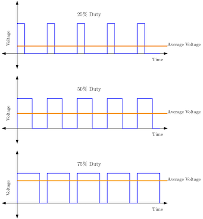

# LEDC on ESP32

## Скважность

$DutyCycle = \frac{T_{on}}{T_{on} + T_{off}} * 100\%$,
где $T_{on}$ - время включения, $T_{off}$ - время выключения

## ESP32-C3

Поддерживается генерация ШИМ-импульсов с помощью периферийных блоков `LEDC (LED PWM Controller)` и `RMT (Remote Control Peripheral)`

`LEDC` предназначена для генерации ШИМ-сигнала для управления светодиодами(диммирование), однако также может быть использована для генерации произвольных импульсов.  
Имеет **6** независимых каналов, управляемых **4** таймерами (делитель 16-бит, счётчик 14-бит). Каждый таймер настраивается независимо, имеет собственную частоту  
 и счётчик. ШИМ-каналы могут быть привязаны к любому из таймеров. Каждый из каналов подключён к пинам `GPIO`.
